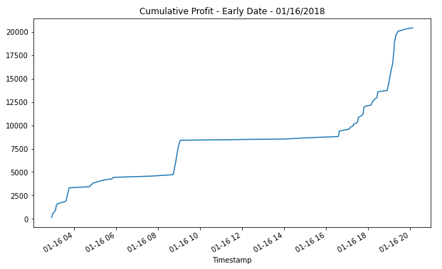
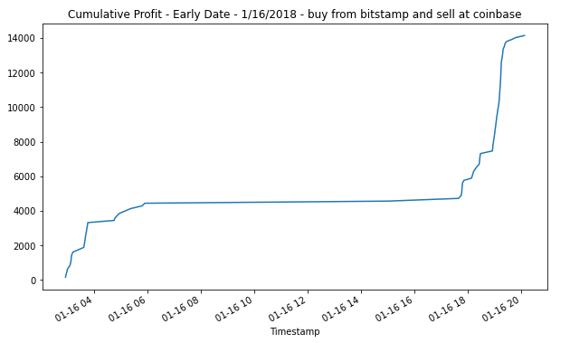
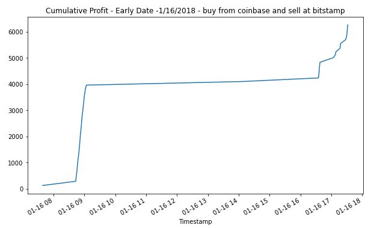
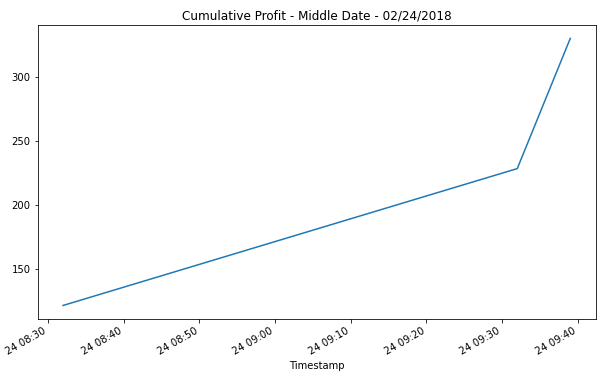

# Project Title
Analyzing Bitcoin/Cryptocurrency Arbitrage opportunities.

Bitcoin/Cryptocurrency arbitrage opportunity occurs when Bitcoin/Cryptocurrency is available at a cheaper price at 
one exchange compared to another exchange. So, we can take advantage of this opportunity by purchasing the cryptocurrency
at the lower priced exchange and selling it as the higher priced exchange. The two exchanges that we analyze are bitstamp
and coinbase. During a given day, at different times, Bitcoin can be purchased at a cheaper price on bitstamp and sold at coinbase
or purchased at a cheaper price on coinbase and sold at bitstamp. We analyse all such opportunities and figure out the potential
profit in doing so. 

### Overall Analysis
Looking at the entire period, it appears that there are potential arbitrage oppotunities when we see the Bitstamp deviate
from the Coinbase - bitstamp line shows prominently and is not hidden by the coinbase line.


### Earlier vs Later Period
Analyzing the earlier period vs later period, we find that there appear to be more arbitrage opportunities in the 
earlier period as compared to the later period. This is true in any arbitrage situation. Once people figure out the 
potential to profit from the price difference, the gap closes very quickly. 


### Analyzing specific dates
Analyzing specific dates in the early, middle and later periods show that there are more opportunities in the early part
of the day and even later part of the day (when the Asia market is starting to get active). During the working hours,
major arbitrage opportunities are non existent. The specific date analysis also confirms that the arbitrage opportunities
diminish in the later period as more people discover price discrepencies. 


### Profit
Analyzing the profit opportunities confirms that profits can be made in the earlier period but there is no profit to be made in the later period. During the earlier period, profit can be made in the early part of the day before the working hours and after working hours when Asia is getting active.

* Profit Summary Table


* Jan 16, 2018 - total arbitrage profits - potential for profit exists in the early hours and then during working hours the arbitrage gap is closed and the gap widens again when people get off work and Asia gets active.



* NOTE: We analyze both possibilities - bitstamp to coinbase and coinbase to bitstamp because during the day both possibilities can exist. Bitcoin can be trading lower at Coinbase at certain times and trading lower at Bitstamp at other times.

* Jan 16, 2018 - arbitrage profits from buying low at bitstamp and selling high at coinbase

 

* Jan 16, 2018 - arbitrage profits from buying low at coinbase and selling high at bitstamp 



* Feb 24, 2018 - arbitrage profits from buying low at bitstamp and selling high at coinbase. There is no profit to be made when trying to buy low at coinbase and selling high at bitstamp



* NOTE: There are no profits to be made on Mar 26, 2018.
---

## Technologies

This project uses python 3.7 along with the following packages:

* [JupyterLab](https://jupyterlab.readthedocs.io/en/stable/) - Web based user interface for data analysis.

* [pandas](https://github.com/pandas-dev/pandas) - Data analysis and manipulation library.

* [matplotlib](https://github.com/matplotlib/matplotlib) - Library for creating visualization in Python.

---

## Installation Guide

Please install the following before starting the application

```python
  pip install jupyterlab
  pip install pandas
  pip install matplotlib
```
In case of issues, please see the requirements.txt for a complete list of packages with versions needed to run this application

---

## Usage

To use the crypto arbitrage analysis, please download and open the **crypto_arbitrage.ipynb** in jupyter lab after executing
the following on the command line:

```python
jupyter lab
```
Jupytper Lab should open automatically in a browser. 
If it does not, please follow the instructions on the command line.

---

## Contributors

Sangram Singh (sangramsinghg@yahoo.com)

---

## License

MIT

